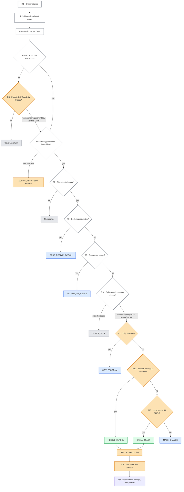

# Zoning Change Indicator: POC notes

**Goal:** find parcel rezonings that a developer probably pursued ("needles in the haystack"). Separate them from vendor and data noise, and from government or code-wide changes.

**Data:** Gridics zoning, two snapshots joined on `clip`.
- **PREV:** `clgx-idap-bigquery-prd-a990.edr_ent_property_zoning_hist.gridics_zoning_archive_250903`
- **CURR:** the active table.

**POC counties:** Maricopa AZ (04013), Alachua FL (12001, Gainesville only) and Orange FL (12095).

## 1. Decision flow

**Legend**
- ⬜ **White:** built rule.
- 🟧 **Orange:** open item (a new data source, a draft rule, or a threshold that still needs QA).
- Outcome boxes:
  - **Grey:** vendor or data noise.
  - 🟦 **Blue:** government or code-wide change.
  - 🟩 **Green:** development signal.

Rule IDs (`R1`–`R15`) match the table in section 2.

## 2. Rules

| # | Rule | Problem it solves | Tag | POC impact | Status |
|---|---|---|---|---|---|
| R1 | Snapshot prep | Keep only valid, comparable records | v1 | n/a | Built |
| R2 | Normalize district codes | Formatting-only differences (`PD` vs `P-D`) | v1/v2 | Up to ~27% of Orange CLIPs (`PD`→`P-D`, to be verified); other counties TBD | Built. **Open:** `RSTD*` vs `RESTRICTED*` prefixes |
| R3 | District set per CLIP | Split-zoned parcels and multiple vendor `zid`s | v2 | ~1% of CLIPs have more than one row | Built |
| R4 | CLIP match | Parcels in only one snapshot | v1 | National: 41.5M → 52.3M distinct CLIPs (mostly vendor coverage growth) | Built |
| R5 | Parcel lineage | Rezoned and then subdivided parcels get new CLIPs | NEW | Unknown | **To build** (lineage product) |
| R6 | Zoning coverage | Parcel in both snapshots but zoning blank in one | v2 | 0.07% (Maricopa), 0.42% (Gainesville), 0.20% (Orange) | Built. **Open:** annexation vs vendor coverage |
| R7 | District set change | Gate: only district changes can be rezonings | v2 | Everything downstream | Built |
| R8 | Code regime switch | The vendor or a jurisdiction swapped the whole zoning code | v2 | 62% of Orange | Built. **Open:** switched jurisdictions aren't measurable |
| R9 | Rename/merge crosswalk | Jurisdiction renamed or merged districts | v2/v6b | 51% of Gainesville | Built |
| R10 | Split-boundary handling | Sliver drop (noise) vs district added (partial rezone) | v2/v6b | 466 of 520 Orange needles were sliver drops | Draft |
| R11 | City program | City-led remap into new districts | v6b | Mesa form-based remaps (DR2→T3N, RM2→T4N…), count TBD | **Draft, thresholds untested** |
| R12 | kNN isolation | Separate single-parcel rezonings from neighborhood-wide changes | v6 | Maricopa 621 / Gainesville 64 / Orange 520 needles | **Thresholds via QA** |
| R13 | Tract size | Developer tract vs mass change | v6 | Maricopa: 700 small-tract / 1,677 mass | **Thresholds via QA** |
| R14 | Annexation flag | County → city move, a developer signal | v6 | ~28 candidates | **Open:** explicit county→city mapping |
| R15 | Use class and direction | Up- vs downzone for QA and reporting | v2/v4 | All candidates | **Open:** transect codes misclassified |

### R1. Snapshot prep `[v1]`
- **What:** keep valid records from each snapshot.
- **Why:** deleted or unkeyed records can't be compared.
- **Data columns:** `clip`, `fips_code`, `clgx_pmd_actionflag`.
- **Algorithm:**
  - `LPAD(fips_code,5,'0') IN (fips_list)`.
  - `clip IS NOT NULL`.
  - `clgx_pmd_actionflag != 'D'`.

### R2. Normalize district codes `[v1/v2]`
- **What:** compare district codes after stripping formatting.
- **Why:** punctuation and case differences look like rezonings (`PD` vs `P-D`).
- **Data columns:** `zoning_district`.
- **Algorithm:**
  - `dcode(x) = UPPER(REGEXP_REPLACE(x, r'[^A-Za-z0-9]', ''))`.
  - Applied before R3.

### R3. District set per CLIP `[v2]`
- **What:** a parcel's zoning is the sorted, de-duplicated set of all districts it falls in.
- **Why:** about 1% of CLIPs have several rows, either split-zoned (different districts) or with several `zid`s for one district. Picking one row per side creates false changes. The vendor `zid` is renumbered on reload, so it's excluded.
- **Data columns:** `zoning_district`. `zid` is deliberately ignored. Derived: `prev_dset`, `curr_dset`.
- **Algorithm:**
  - `STRING_AGG(DISTINCT dcode(zoning_district), '|' ORDER BY dcode(zoning_district))` per CLIP.
  - `DISTINCT` collapses duplicate `zid`s; `ORDER BY` makes `R1|C2` and `C2|R1` the same.

### R4. CLIP match `[v1]`
- **What:** pair parcels across snapshots on `clip`.
- **Why:** most parcels found in only one snapshot come from wider vendor coverage, not zoning change.
- **Data columns:** `clip`. Derived: `presence` = `BOTH` / `ADDED` / `REMOVED`.
- **Algorithm:**
  - Full outer join PREV and CURR on `clip`.
  - `BOTH` continues to R6; the others go to R5.

### R5. Parcel lineage `[NEW]`
- **What:** link new CLIPs to the parent CLIP they were split from.
- **Why:** developers often rezone and then subdivide. The new lots get new CLIPs, so R4 misses exactly the rezonings we want most.
- **Data columns:** Cotality parcel lineage (parent CLIP → child CLIP). Derived: `lineage_parent_clip`, `is_split`.
- **Algorithm:**
  - For `ADDED` CLIPs, look up the parent.
  - Use the parent's PREV district set against the child's CURR set, then continue at R6.
  - Without a parent, the CLIP is coverage churn.

### R6. Zoning coverage `[v2]`
- **What:** the parcel exists in both snapshots, but zoning is blank in one.
- **Why:** usually vendor coverage; sometimes a real annexation or newly zoned land.
- **Data columns:** `prev_dset`, `curr_dset`.
- **Algorithm:**
  - One side NULL → `ZONING_ASSIGNED` / `ZONING_DROPPED`.
  - **Open:** tell annexation apart from vendor coverage.

### R7. District set change `[v2]`
- **What:** the core gate: did the normalized district set change?
- **Why:** only a district change can be a rezoning. Rule-value changes (height, setbacks, density) are out of scope for this indicator.
- **Data columns:** `prev_dset`, `curr_dset`.
- **Algorithm:** `prev_dset IS DISTINCT FROM curr_dset`.

### R8. Code regime switch `[v2]`
- **What:** detect when a jurisdiction's whole zoning code was swapped.
- **Why:** Orange PREV used "Orange Code 2050" (transect districts), while CURR uses "Chapter 38" (legacy districts). That produced about 267K "changes"; only 56 were real rezonings.
- **Data columns:** `zoning_regulation_name` (`prev_reg`, `curr_reg`). Derived: `reg_n`, `reg_district_chg_share`.
- **Algorithm:**
  - Per `(fips, prev_reg)`, flag a switch when all of these hold:
    - `prev_reg != curr_reg`;
    - `reg_district_chg_share >= 0.5`;
    - `reg_n >= 20`.
  - Rezonings inside a switched jurisdiction can't be measured this period.

### R9. Rename/merge crosswalk `[v2/v6b]`
- **What:** learn which old district maps to which new one across a jurisdiction.
- **Why:** Gainesville merged RSF1–4 into SF (~18.5K CLIPs).
- **Data columns:** `prev_dset`, `curr_dset`, `prev_reg`. Derived: `rename_map`, `prev_dset_mapped`.
- **Algorithm:**
  - From single-district CLIPs, per `(fips, prev_reg, prev_dset)`: it's a rename if the top target's share is ≥ 0.9 and n ≥ 20.
  - Apply the map to each element of split-zoned sets, which catches `PD|RSF1 → PD|SF`.

### R10. Split-boundary handling `[v2/v6b]`
- **What:** interpret changes in split-zoned sets.
- **Why:** a dropped district is usually a boundary sliver (`T43|T52 → T52`); an added district is a partial rezoning (`CAN → CAN|PD`).
- **Data columns:** `prev_dset_mapped`, `curr_dset`. Derived: `is_sliver_drop`, `is_partial_rezone`.
- **Algorithm:**
  - curr ⊂ prev → `SLIVER_DROP`.
  - prev ⊂ curr → `is_partial_rezone = TRUE`, and the parcel continues.
  - Anything else continues.

### R11. City program `[v6b]`
- **What:** detect city-led remaps that look like scattered rezonings.
- **Why:** Mesa's new form-based districts (`DR2 → T3N`, `RM2 → T4N`, `DC → T6MS`) showed up among the needles.
- **Data columns:** `curr_dset`, `prev_dset`, `prev_use_class`, coordinates. Derived: `tgt_is_new_district`, `tgt_n_src`, `tgt_n_clusters`, `tgt_ag_src_share`.
- **Algorithm:** `CITY_PROGRAM` if either:
  - the target district didn't exist in PREV; or
  - the target received rezonings from ≥ 4 source districts in ≥ 10 separate clusters (300 m apart), with less than 50% coming from AG or unzoned land.

### R12. kNN isolation `[v6]`
- **What:** check whether a candidate's neighbors made the same change.
- **Why:** Product definition: a developer-driven rezoning is isolated; a shared change is not.
- **Data columns:** `clip_latitude`, `clip_longitude`, transition (`prev_dset → curr_dset`). Derived: `n_colocated`, `k20_same_tr`.
- **Algorithm:**
  - Take the 20 nearest sites within 1 km, excluding sites at the same point (condos).
  - If ≤ 15% of them share the transition → `NEEDLE_PARCEL`.

### R13. Tract size `[v6]`
- **What:** decide whether a non-isolated change is a developer tract or a mass change.
- **Why:** developers often rezone whole tracts of 20–100 lots, which R12 alone would discard.
- **Data columns:** coordinates, transition. Derived: `n_same_tr_1km`.
- **Algorithm:**
  - Same-transition CLIPs within 1 km ≤ 50 → `SMALL_TRACT`.
  - Otherwise → `MASS_CHANGE`.

### R14. Annexation flag `[v6]`
- **What:** flag candidates whose governing regulation changed, for example from county to city code.
- **Why:** annexation is usually developer-requested, so it's a strong signal.
- **Data columns:** `zoning_regulation_name`. Derived: `is_annexation`.
- **Algorithm:**
  - Currently: `prev_reg IS DISTINCT FROM curr_reg`, outside R8.
  - **Open:** map regulation names to jurisdiction types to detect county → city explicitly.

### R15. Use class and direction `[v2/v4]`
- **What:** label each district with a broad use class and give each candidate a direction (up- or downzone).
- **Why:** needed for QA and reporting. Intensity values are often missing, so direction is frequently inferred.
- **Data columns:** `zoning_district`, `zone_district_description`, `floor_area_ratio`, `maximum_building_height_feet`, `residential_density`. Derived: `prev_use_class`, `curr_use_class`, `direction`.
- **Algorithm:**
  - `use_class` is a keyword heuristic.
  - Direction is the measured intensity change if there is one. Otherwise it's inferred from the use rank (CONS < AG < SF < MF < MU/COM/IND), then `USE_CHANGE`, then `UNKNOWN`.
  - **Open:** transect codes (T3.x) are misclassified as AG.

### QA signals (not rules)
Land-use changes and new permits usually *follow* a rezoning. They can confirm needles after the fact but can't detect them in the same period.