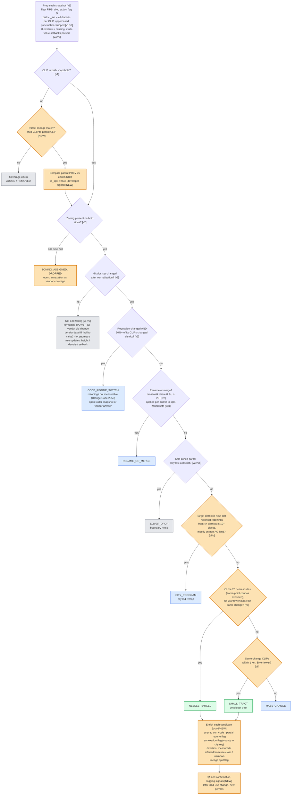

# Zoning Change Indicator: POC notes

**Goal:** find parcel rezonings that a developer probably pursued ("needles in the haystack"). Separate them from vendor and data noise, and from government or code-wide changes.

**Data:** Gridics zoning, two snapshots joined on `clip`.
- **PREV:** `clgx-idap-bigquery-prd-a990.edr_ent_property_zoning_hist.gridics_zoning_archive_250903`
- **CURR:** the active table.

**POC counties:** Maricopa AZ (04013), Alachua FL (12001, Gainesville only) and Orange FL (12095).

## 1. Rules catalog

Every rule we tried from v1 to v6b.

**Relevance** says whether the rule matters for the needle indicator:
- **Core:** needed.
- **Support:** feeds enrichment or QA.
- **Not needed:** only used to describe non-rezoning change.
- **Dropped:** tried and rejected.

### Summary

| # | Rule | Problem it solves | Tag | Relevance |
|---|---|---|---|---|
| R1 | Snapshot prep and CLIP join | Build a like-for-like parcel comparison | v1 | Core |
| R2 | District set per CLIP | Parcels that sit in more than one district (split-zoned) | v1/v2 | Core |
| R3 | District code normalization | Formatting-only differences (`PD` vs `P-D`) | v1/v2 | Core |
| R4 | Ignore vendor zone ID (`zid`) | The vendor renumbers IDs when it reloads data | v1 | Core |
| R5 | Presence and zoning coverage | Parcels or zoning appearing or disappearing between snapshots | v1/v2 | Core |
| R6 | Code regime switch | The vendor or a jurisdiction swapped the entire zoning code | v2 | Core |
| R7 | Rename/merge crosswalk | Districts renamed or merged by the jurisdiction | v2/v6b | Core |
| R8 | Split-boundary handling | A split-zoned parcel loses or gains a district | v2/v6b | Core |
| R9 | Zero or blank means missing | The vendor uses 0 for "not specified" | v3/v5 | Not needed |
| R10 | Rule kind | Split rule changes into intensity, coverage and dimensional | v3 | Not needed |
| R11 | Rule-change scope | Jurisdiction-, district- or parcel-wide rule changes | v2/v3/v4/v5 | Not needed |
| R12 | Lot geometry only | Parcel shape or area refresh | v2/v5 | Core (as a noise filter) |
| R13 | Use class and direction | Up- vs downzone | v2/v4 | Support |
| R14 | Spatial clustering (DBSCAN) | Area rezoning vs parcel rezoning | v2 | Replaced by R15 |
| R15 | kNN neighborhood share | Needle vs small tract vs mass change | v6 | Core |
| R16 | City program | City-led remap into new districts, e.g. form-based codes | v6b | Core |
| R17 | Annexation / regulation move | Parcel moves from county to city code | v6 | Support (developer signal) |
| R18 | Parcel lineage | Rezoned parcels that were later subdivided (new CLIPs) | NEW | Core (to build) |
| R19 | Refresh via `last_updated` | Detect which records the vendor reloaded | v1 | Dropped |

---

### R1. Snapshot prep and CLIP join `[v1]`
- **What:** keep valid records from each snapshot and pair them on the parcel ID.
- **Why:** the indicator is defined per parcel. We need to know which parcels are comparable at all.
- **Data columns:** `clip`, `fips_code`, `clgx_pmd_actionflag`, `clgx_pmd_load_timestamp`.
- **Algorithm:**
  - Filter to `LPAD(fips_code,5,'0') IN (fips_list)` and `clip IS NOT NULL`.
  - Drop rows where `clgx_pmd_actionflag = 'D'`.
  - Full outer join PREV and CURR on `clip`, producing `presence` = `BOTH` / `ADDED` / `REMOVED`.

### R2. District set per CLIP `[v1/v2]`
- **What:** represent a parcel's zoning as the *set* of districts it falls in, not a single value.
- **Why:** about 1% of CLIPs have more than one row, because they are split-zoned or have several zone IDs for the same district. Comparing one arbitrary row per side creates false changes.
- **Data columns:** `zoning_district`, `zid`. Derived: `prev_dset`, `curr_dset`, `prev_n_rows`, `curr_n_rows`.
- **Algorithm:**
  - `dset = STRING_AGG(DISTINCT dcode(zoning_district), '|' ORDER BY ...)` per CLIP.
  - For rule values, pick one representative row: `ORDER BY dcode(zoning_district) NULLS LAST, zid, clgx_pmd_load_timestamp DESC`.

### R3. District code normalization `[v1/v2]`
- **What:** compare district codes after stripping formatting.
- **Why:** punctuation-only differences look like changes (for example `PD` vs `P-D` in Orange). Case and whitespace differences turned out to be negligible.
- **Data columns:** `zoning_district`. Derived: `raw_district_chg`, `district_chg`.
- **Algorithm:**
  - `dcode(x) = UPPER(REGEXP_REPLACE(x, r'[^A-Za-z0-9]', ''))`.
  - Formatting-only is `raw_district_chg AND NOT district_chg`.
  - **Open:** prefix variants such as `RSTD*` vs `RESTRICTED*` still need normalizing.

### R4. Ignore vendor zone ID `[v1]`
- **What:** a `zid` change by itself is not a zoning change.
- **Why:** the vendor renumbers `zid` when it reloads data, so `zid`-only changes are noise.
- **Data columns:** `zid`. Derived: `zid_chg`.
- **Algorithm:** a `zid_chg` with no change in the district set is classed as `VENDOR_ZID_CHANGE` / `NO_MATERIAL_CHANGE`.

### R5. Presence and zoning coverage `[v1/v2]`
- **What:** handle parcels, or their zoning, that exist in only one snapshot.
- **Why:** vendor coverage grew from 487 to 629 FIPS and from 41.9M to 52.8M rows. Most ADDED/REMOVED records are coverage churn, not rezonings.
- **Data columns:** `presence`, `prev_dset`, `curr_dset`.
- **Algorithm:**
  - `presence != 'BOTH'` means coverage churn.
  - If the parcel is in both snapshots but zoning is NULL on one side, it becomes `ZONING_ASSIGNED` / `ZONING_DROPPED`.
  - **Open:** tell annexation or new zoning apart from vendor coverage changes.

### R6. Code regime switch `[v2]`
- **What:** detect when a jurisdiction's whole zoning code was swapped.
- **Why:** in Orange, the vendor loaded "Orange Code 2050" (transect districts) in PREV and "Chapter 38" (legacy districts) in CURR. That produced about 267K "district changes", 62% of the county. Real rezonings in Orange: 56.
- **Data columns:** `zoning_regulation_name` (`prev_reg`, `curr_reg`). Derived: `reg_n`, `reg_district_chg_share`.
- **Algorithm:**
  - Group by `(fips, prev_reg)`.
  - Flag `CODE_REGIME_SWITCH` when `prev_reg != curr_reg`, `reg_district_chg_share >= 0.5` and `reg_n >= 20`.
  - Rezonings inside a switched regulation **can't be measured** for that period. The many-to-many mapping from transect to legacy districts makes it impossible to recover them.

### R7. Rename/merge crosswalk `[v2/v6b]`
- **What:** learn which old district maps to which new district across the jurisdiction.
- **Why:** Gainesville merged RSF1–4 into SF, which touched about 18.5K CLIPs (51% of the city).
- **Data columns:** `prev_dset`, `curr_dset`, `prev_reg`. Derived: `rename_map`, `xwalk_top_share`, `prev_dset_mapped`.
- **Algorithm:**
  - For single-district CLIPs, count `(prev_dset → curr_dset)` within each `(fips, prev_reg, prev_dset)`.
  - It's a rename if the top target's share is at least 0.9 and n is at least 20.
  - **v6b:** apply the map to *each element* of split-zoned sets. This catches leaks like `PD|RSF1 → PD|SF`.

### R8. Split-boundary handling `[v2/v6b]`
- **What:** decide what it means when a split-zoned parcel's set of districts changes.
- **Why:** Orange had 466 changes like `T43|T52 → T52`, which were boundary slivers. By contrast, `CAN → CAN|PD` is a real partial rezoning.
- **Data columns:** `prev_dset_mapped`, `curr_dset`. Derived: `is_sliver_drop`, `is_partial_rezone`.
- **Algorithm:** using `is_subset(a, b)` on the `'|'` sets:
  - curr ⊂ prev (a district was dropped) → `NOISE_SLIVER_DROP`.
  - prev ⊂ curr (a district was added) → `is_partial_rezone = TRUE`, and the parcel stays a candidate.

### R9. Zero or blank means missing `[v3/v5]`
- **What:** treat 0 and blank as "not specified", and separate filled-in values from real value changes.
- **Why:** Mesa's roughly 159K "rule changes" were 100% `null/0 → value` fills, with 0 real changes. Maricopa County's rear setbacks were the same (`null → 40`).
- **Data columns:** `floor_area_ratio`, `maximum_building_height_*`, `residential_density`, `maximum_lot_coverage`, `minimum_open_space`, `minimum_*_setback` (STRING, e.g. `"3|10"`), `maximum_*_setback`.
- **Algorithm:**
  - `m(x) = NULLIF(x, 0)`.
  - Setback strings: `sb(s)` = the smallest number parsed from the string, with 0 treated as missing.
  - `real_chg` = both sides present and different.
  - `cov_flip` = exactly one side present, i.e. a vendor fill or drop.

### R10. Rule kind `[v3]`
- **What:** label what kind of rule changed.
- **Why:** height, density and FAR changes (intensity) mean something very different from setbacks or lot coverage.
- **Data columns:** outputs of R9. Derived: `rule_kind`.
- **Algorithm:** priority order is `INTENSITY` (FAR, height, density), then `COVERAGE` (lot coverage and open space), then `DIMENSIONAL` (setbacks), then `OTHER_OR_NULL_ZERO`.

### R11. Rule-change scope `[v2/v3/v4/v5]`
- **What:** decide whether a rule change applies to a whole jurisdiction, a district or a single parcel.
- **Why:** examples of each:
  - Gilbert raised SF-6 density from 5 to 8 (~25K CLIPs).
  - Orlando lowered height from 35 to 30 ft across 20+ districts (~30K).
  - Maricopa County changed RU-190 lot coverage (~8.9K).
- **Data columns:** outputs of R9 and R10. Derived: `reg_rule_share`, `dist_rule_share`, `delta_signature`.
- **Algorithm:**
  - Among CLIPs with no district change, compute the share of CLIPs with a real change:
    - share ≥ 0.5 within the regulation → `JURISDICTION_*`;
    - share ≥ 0.8 within the district → `DISTRICT_*`;
    - otherwise → `PARCEL_*`.
  - **v4:** the `delta_signature` (e.g. `DENS:5>8`) appearing in 3 or more districts of the same regulation → `JURISDICTION`.

### R12. Lot geometry only `[v2/v5]`
- **What:** changes that only affect parcel shape or area.
- **Why:** 21% of Maricopa CLIPs changed only because the parcel geometry was refreshed. Setbacks didn't move with lot geometry.
- **Data columns:** `lot_area_gis`, `frontage_length`. Derived: `lot_area_chg`, `geom_chg`.
- **Algorithm:** when there's no district change and no real rule change but `geom_chg` is true → `LOT_GEOMETRY_ONLY`.

### R13. Use class and direction `[v2/v4]`
- **What:** map each district to a broad use and infer whether the change is an up- or downzone.
- **Why:** intensity values are often missing, especially in form-based codes, so direction can't always be measured.
- **Data columns:** `zoning_district`, `zone_district_description`, rule values from R9. Derived: `prev_use_class`, `curr_use_class`, `use_transition`, `direction_v4`.
- **Algorithm:**
  - `use_class` is a keyword heuristic on code and description, with the first match winning. The classes are UNZONED, PLANNED_DEV, AG, IND, CONSERVATION, MU, COM, MF, SF, OTHER.
  - Direction is the measured FAR, height or density change when one exists.
  - Otherwise it's inferred from `use_rank` (CONS 0, AG 1, SF 2, MF 3, MU/COM/IND 4). If that doesn't apply, the result is `USE_CHANGE`, then `UNKNOWN`.
  - **Open:** transect codes (T3.x) are misclassified as AG because their descriptions contain "rural".

### R14. Spatial clustering, DBSCAN `[v2]` (replaced by R15)
- **What:** group rezonings that share the same transition and are close together.
- **Why:** first attempt at separating area rezonings from parcel rezonings.
- **Data columns:** `clip_latitude`, `clip_longitude`. Derived: `rezone_scale` = AREA / PARCEL / NO_COORDS.
- **Algorithm:** `ST_CLUSTERDBSCAN(geog, 150 m, minPts 5) OVER (PARTITION BY fips, prev_dset, curr_dset)`.
- **Why replaced:** a fixed radius doesn't adapt to parcel density; 150 m is a lot of parcels in a city and very few in rural areas.

### R15. kNN neighborhood share `[v6]`
- **What:** for each candidate, check whether its neighbors made the same change.
- **Why:** the Product definition. A developer-driven rezoning is isolated or tract-sized; a change shared by most neighbors is a mass change.
- **Data columns:** `clip_latitude`, `clip_longitude`, transition. Derived: `n_colocated`, `k10/k20/k50_same_tr`, `n_same_tr_250m`, `n_same_tr_1km`, `d_k20_m`, `needle_tier`.
- **Algorithm:**
  - Take neighbors within 1 km, excluding those at the same point (condos): 20 nearest.
  - If the share with the same transition is ≤ 0.15 → `NEEDLE_PARCEL`.
  - Else, if the same-transition CLIPs within 1 km number ≤ 50 → `SMALL_TRACT`.
  - Otherwise → `MASS_CHANGE`.
  - **Open:** Maricopa shows no plateau across k and the share cutoff, so the thresholds must be set through QA.

### R16. City program `[v6b]`
- **What:** detect city-led remaps into new districts that look like scattered rezonings.
- **Why:** Mesa's new form-based districts (`DR2 → T3N`, `RM2 → T4N`, `DC → T6MS`) appeared in every tier, including needles.
- **Data columns:** `curr_dset`, `prev_dset`, `prev_use_class`, coordinates. Derived: `tgt_is_new_district`, `tgt_n_src`, `tgt_n_clusters`, `tgt_ag_src_share`.
- **Algorithm:** `CITY_PROGRAM` if either:
  - the target district didn't exist in PREV; or
  - the target received rezonings from 4 or more source districts in 10 or more separate clusters (DBSCAN at 300 m), with less than 50% coming from AG or unzoned land.
- **Open:** thresholds are untested.

### R17. Annexation / regulation move `[v6]`
- **What:** the parcel's governing regulation changed, for example from county code to city code.
- **Why:** annexation is often requested by developers, so it's a strong signal. There were about 28 cases among candidates.
- **Data columns:** `zoning_regulation_name`. Derived: `is_annexation_or_reg_move`.
- **Algorithm:**
  - Currently: `prev_reg IS DISTINCT FROM curr_reg`, outside a code regime switch.
  - **Open:** explicitly detect county → city moves by mapping regulation names to jurisdiction types.

### R18. Parcel lineage `[NEW]`
- **What:** link new CLIPs to the parent CLIPs they were split from.
- **Why:** developers often rezone and then subdivide. The new lots get new CLIPs, so the CLIP join (R1) misses exactly the rezonings we want most.
- **Data columns:** Cotality parcel lineage product (parent CLIP → child CLIP). Derived: `lineage_parent_clip`, `is_split`.
- **Algorithm:**
  - For `ADDED` CLIPs, look up the parent.
  - Compare the parent's PREV zoning with the child's CURR zoning.
  - Feed the result into R6 → R16, with `is_split` as a boosting signal.

### R19. Refresh via `last_updated` `[v1]` (dropped)
- **What:** use the vendor's `last_updated` to see which records it reloaded.
- **Why dropped:** the field is inconsistent with the actual reloads (for example, Gainesville was fully reloaded on 2026-08-29), so it's not a reliable refresh signal.

### Out of scope, used for QA only
Land-use changes and new permits usually *follow* a rezoning. They can confirm needles after the fact but can't detect them in the same period.

### Decision flow

**Legend**
- 🟧 **Orange**: open item (a new column or data source, or a threshold that still needs tuning)
- ⬜ **Grey**: vendor or data noise
- 🟦 **Blue**: government or code-wide change
- 🟩 **Green**: development signal

Tags such as `[v1]` … `[v6b]` show the query version that introduced each rule. `[NEW]` marks a rule that hasn't been built yet.

### Columns and rules to build

| Column / rule | Purpose | Tag | Status |
|---|---|---|---|
| `prev_dset`, `curr_dset` | Normalized, sorted set of districts per CLIP | v1/v2 | Built. **Open:** normalize RSTD/RESTRICTED prefixes |
| `lineage_parent_clip`, `is_split` | Recover rezoned and subdivided parcels | NEW | **Needs the parcel lineage product** |
| `reg_district_chg_share` | Detect code-regime switches | v2 | Built. **Open:** handling for jurisdictions that aren't measurable |
| `rename_map` (crosswalk share) | Renames and merges, including within split-zoned sets | v2/v6b | Built |
| `is_sliver_drop`, `is_partial_rezone` | Split-zoned boundary noise vs a partial rezoning | v6b | Draft |
| `tgt_is_new_district`, `tgt_n_src`, `tgt_n_clusters`, `tgt_ag_src_share` | City-program detection | v6b | Draft. **Thresholds to be set** |
| `n_colocated`, `k20_same_tr`, `n_same_tr_1km` | Needle vs tract vs mass change | v6 | Built. **Thresholds to be set through QA** |
| `is_annexation` | Developer signal | v6 | Built. **Open:** detect county→city regulation explicitly |
| `prev_use_class`, `curr_use_class`, `direction` | Up/downzone | v2/v4 | Built. **Open:** transect codes are misclassified |
| Parsed rule values (0 = missing) | Only for reporting non-rezoning change | v3/v5 | Built. Not needed for needles |