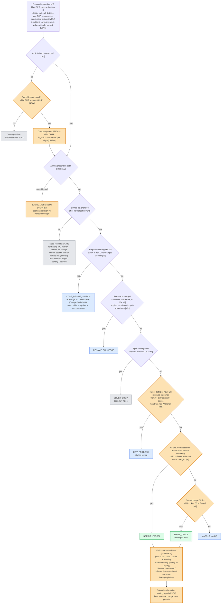

## 1. Decision flow

**Legend**
- 🟧 **Orange**: open item (a new column or data source, or a threshold that still needs tuning)
- ⬜ **Grey**: vendor or data noise
- 🟦 **Blue**: government or code-wide change
- 🟩 **Green**: development signal

Tags such as `[v1]` … `[v6b]` show the query version that introduced each rule. `[NEW]` marks a rule that hasn't been built yet.

### Columns and rules to build

| Column / rule | Purpose | Tag | Status |
|---|---|---|---|
| `prev_dset`, `curr_dset` | Normalized, sorted set of districts per CLIP | v1/v2 | Built. **Open:** normalize RSTD/RESTRICTED prefixes |
| `lineage_parent_clip`, `is_split` | Recover rezoned and subdivided parcels | NEW | **Needs the parcel lineage product** |
| `reg_district_chg_share` | Detect code-regime switches | v2 | Built. **Open:** handling for jurisdictions that aren't measurable |
| `rename_map` (crosswalk share) | Renames and merges, including within split-zoned sets | v2/v6b | Built |
| `is_sliver_drop`, `is_partial_rezone` | Split-zoned boundary noise vs a partial rezoning | v6b | Draft |
| `tgt_is_new_district`, `tgt_n_src`, `tgt_n_clusters`, `tgt_ag_src_share` | City-program detection | v6b | Draft. **Thresholds to be set** |
| `n_colocated`, `k20_same_tr`, `n_same_tr_1km` | Needle vs tract vs mass change | v6 | Built. **Thresholds to be set through QA** |
| `is_annexation` | Developer signal | v6 | Built. **Open:** detect county→city regulation explicitly |
| `prev_use_class`, `curr_use_class`, `direction` | Up/downzone | v2/v4 | Built. **Open:** transect codes are misclassified |
| Parsed rule values (0 = missing) | Only for reporting non-rezoning change | v3/v5 | Built. Not needed for needles |